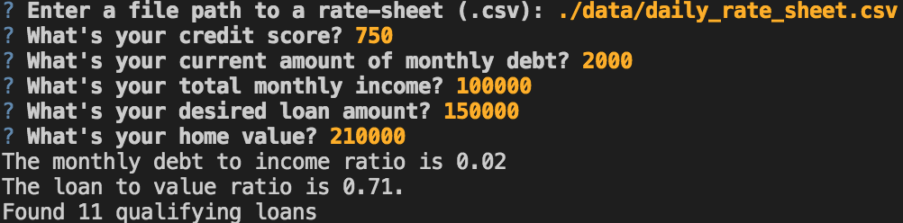
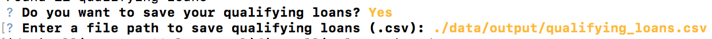

# Loan Qualifier Application

This is a python command-line interface application that allows users to see qualifying loans from lenders quickly and easily. The application works by taking in a `daily_rate_sheet` of loan criteria from various loan providers, asks the user a number of questions to evaluate their loan eligibility, and then returns to them a list of qualifying loans. The program then asks the user if they would like to save the data as a csv file.

---

## Technologies

This project leverages python 3.7 with the following packages:

* [fire](https://github.com/google/python-fire) - For the command line interface, help page, and entrypoint.

* [questionary](https://github.com/tmbo/questionary) - For interactive user prompts and dialogs

* [pytest](https://docs.pytest.org/en/stable/) - For basic assertion testing of financial calculators and filters, and fileio.

---

## Installation Guide

Before running the application first install the following dependencies.

```python
  pip install fire
  pip install questionary
  pip install pytest
  pip install mkdocs
```

---

## Usage

To use the loan qualifier application simply clone the repository and run the **app.py** with:

```python
python app.py
```

Upon launching the loan qualifier application you will be greeted with the following prompts.



After the application filters through the bank list, you will be asked if you want to save the qualifying data as a csv file and then asked to provide a file path for export.



You can access your filtered bank data by navigating to the folder you provided when saving the data.

---

## Contributors

Elliot Lozano, Texas A&M University '19

---

## License

MIT